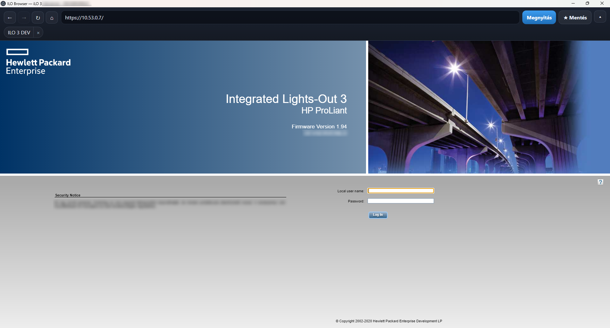
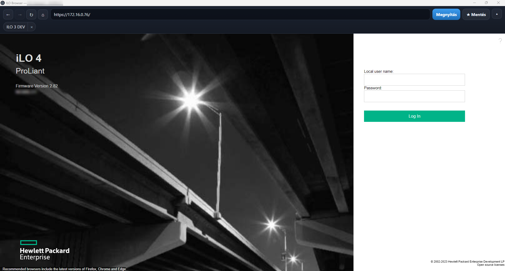
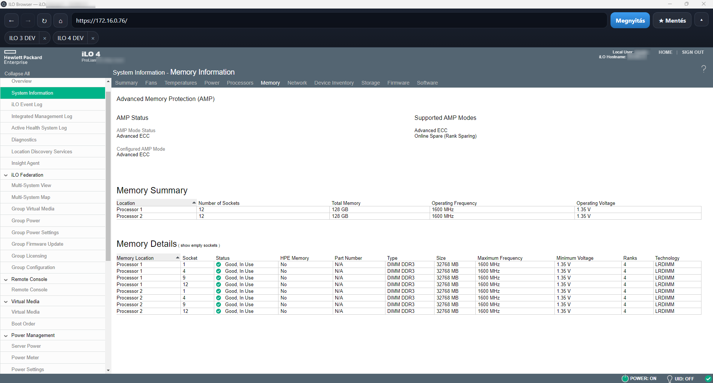

# ILO Browser

**English** · [Magyar](#magyar)

Ready-to-run **portable Windows app** for opening legacy **HP iLO** web interfaces that modern browsers block (outdated TLS / self-signed certificates).

This repository contains the **finished product only** (the `.exe`). Source code is not included.

---

## Download

| File | Description |
|------|-------------|
| [`ILO-Browser.exe`](ILO-Browser.exe) | Portable app for **Windows 10+ (64-bit)** |

No installer. No administrator rights required. Double-click to run.

---

## Features

- Works with iLO **2 / 3 / 4 / 5 / 6** web UIs
- Allows TLS 1.0 and certificate errors
- Address bar, back / forward / reload / home
- Collapsible toolbar
- Saved bookmarks (one-click)
- Hungarian / English UI

> Old **Java Remote Console** applets are not supported. Newer HTML5 consoles generally work.

---

## Usage

1. Download `ILO-Browser.exe`
2. Run it
3. Enter the iLO IP or URL (e.g. `192.168.1.50`)
4. Click **Open**
5. Optional: **★ Save** for one-click access later

Settings and bookmarks are stored next to the exe in `ILO-Browser-data`.

---

## Requirements

- Windows **10 or newer**, **64-bit**
- Network access to the iLO interface

---

This project was created in part with AI assistance.

The app does not send any data to remote services.

---
---

# Magyar

[English](#ilo-browser)

Kész, azonnal futtatható **portable Windows alkalmazás** régi **HP iLO** webfelületekhez, amelyeket a mai böngészők elavult TLS / self-signed tanúsítvány miatt nem nyitnak meg.

Ez a tároló **csak a kész terméket** tartalmazza (az `.exe` fájlt). Forráskód nincs benne.

---

## Letöltés

| Fájl | Leírás |
|------|--------|
| [`ILO-Browser.exe`](ILO-Browser.exe) | Portable app **Windows 10+ (64 bites)** rendszerekre |

Nincs telepítő. Nem kell adminisztrátori jog. Dupla kattintással indul.

---

## Funkciók

- iLO **2 / 3 / 4 / 5 / 6** webes felület
- TLS 1.0 és tanúsítványhibák átengedése
- Címsáv, vissza / előre / újratöltés / kezdőlap
- Összecsukható eszköztár
- Mentett címek (egy kattintás)
- Magyar / angol felület

> A régi **Java Remote Console** appletek nem támogatottak. Az újabb HTML5 konzolok általában működnek.

---

## Használat

1. Töltsd le az `ILO-Browser.exe` fájlt
2. Indítsd el
3. Add meg az iLO IP-t vagy URL-t (pl. `192.168.1.50`)
4. Kattints a **Megnyitás** gombra
5. Opcionális: **★ Mentés** a későbbi egykattintásos nyitáshoz

A beállítások és mentések az exe mellett az `ILO-Browser-data` mappába kerülnek.

---

## Követelmények

- Windows **10 vagy újabb**, **64 bites**
- Hálózati elérés az iLO felülethez

---

Ez a projekt részben AI segítségével készült.

Az alkalmazás semmilyen távoli adatszolgáltatást nem végez.

---

## Screenshots

iLO 3 bejelentkező felület:

iLO 4 bejelentkező felület:

iLO 4 rendszerinformáció (memória):

